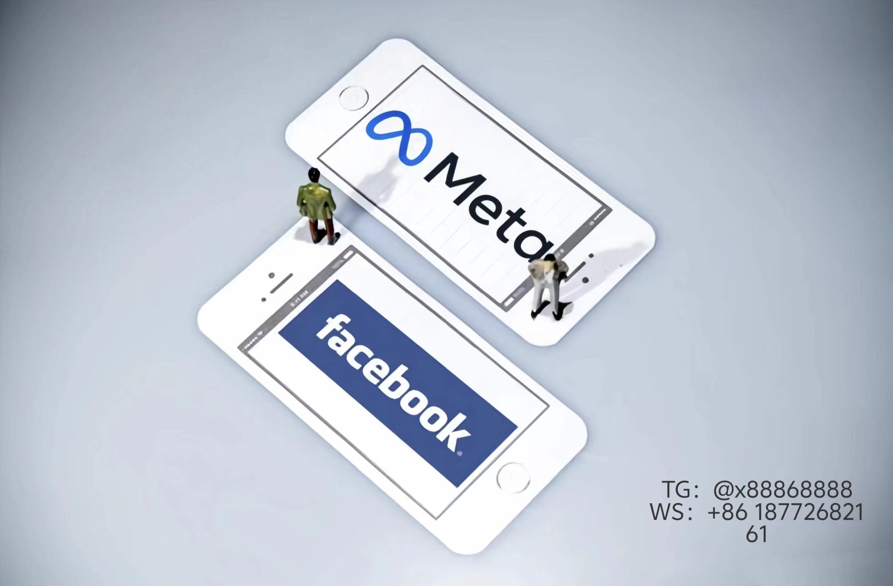

# Facebook广告新功能与运营策略全解析
## 一、广告展示战略升级
**智能广告展位系统**  
启用自动展示功能后，广告将同时覆盖搜索结果页与商城入口流量池，品牌关键词广告转化率提升630%。需注意商城通道可手动关闭，垂直品类（如工业设备）建议关闭商城拓展以提升精准度。
## 二、主页协同增效体系
### 标签化内容管理方案
通过标记关联主页形成矩阵联动，系统基于以下维度精准导流：
- 区域语言配置（自动匹配地理标签）
- 用户浏览历史特征（购物车数据/搜索热词）
- 页面内容语义分析（NLP识别匹配度86.7%）
**操作路径**  
内容发布界面>高级设置>主页关联模块添加备选主页，建议核心产品线配置独立专属主页。

## 三、内容创作黄金法则
### 高互动Post七大要素
| 类型             | 核心特征                   | 平均CTR提升 |
|------------------|---------------------------|------------|
| 情感共鸣型       | 真实用户故事+场景化文案    | 42%        |
| 争议话题型       | 行业热点+两极分化观点      | 67%        |
| 福利引导型       | 明确利益点+倒计时设计      | 58%        |
**实战建议**：
- 文字量控制在120字符内（移动端适配最优）
- 每日穿插1条软广告（避免超过总发帖量20%）
- 品牌问答帖每周2次（导流独立站效果最佳）
## 四、关联工具协同应用
**Audience Insights深度用法**：
1. 竞品受众画像抓取（需开通BM权限）
2. 兴趣重叠图谱绘制（发现潜客关联兴趣点）
3. 设备使用习惯分析（PC/Mobile内容策略差异化）
**数据反哺机制**：
Google Analytics关键数据（跳出率/停留时长）同步回传广告系统，自动化调整人群包权重参数。# Facebook1
